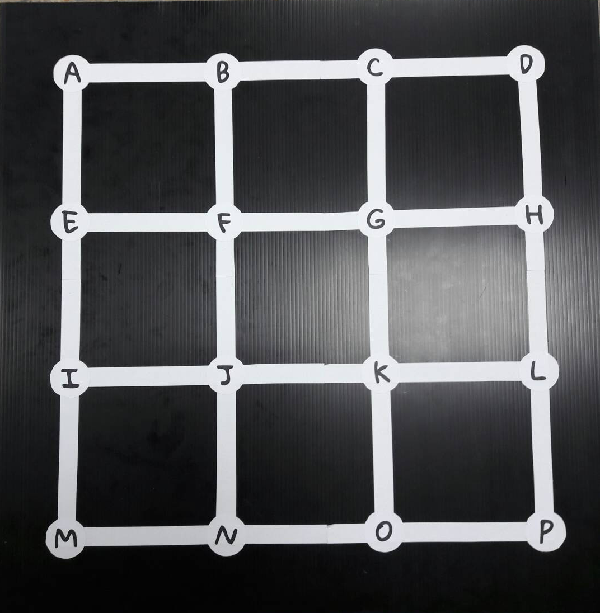
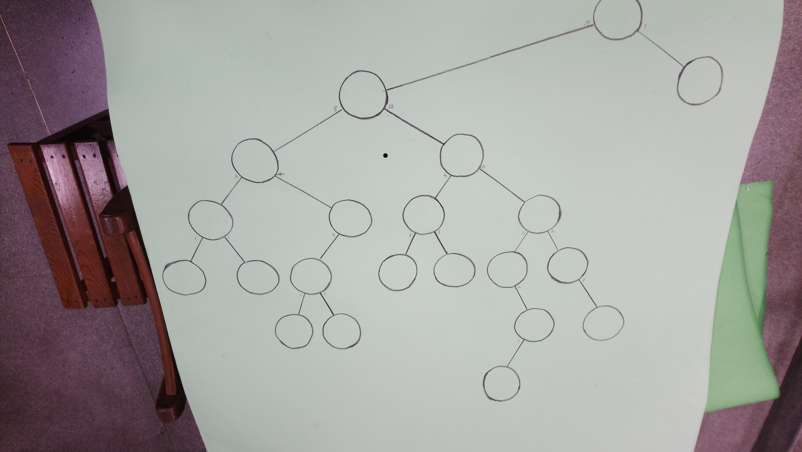

# 算法大地
###### Wu-Jun Pei @ CSCamp 2019

--

## Explosion

---

#### 2-SAT Problem
- 一個 literal
	```python
x1
```
- 一個 cluase
	```python
(x1 or x2)
```
- 一個 2-SAT expression
	```python
clause1 and clause2 and ...
```
- Example
	```python
(x1 or x2) and (x2 or x3) and (x1 or not x4)
```
- 想要找到一種 (x1, x2, ..., x) 使得 expression 成立

---

#### 2-SAT Problem - Solution
- 解法：可以很有效率（線性）的算出一組解／算出無解
- 不特別說明怎麼做
- 黑魔法，感謝前人

---



---

#### Explosion
From ***A*** to ***L*** 可以走 either
1. 第零橫路＋第三直路
2. 第零直路＋第二橫路

---

#### Explosion - Notation
- Event $R_i$：第 $i$ 橫路往右走
- Event $C_j$：第 $j$ 直路往下走

From ***A*** to ***L*** 的表達式：
```python
(R0 and C3) or (C0 and R2)
```

is equivalent to

```python
(R0 or C0) and (R0 or R2) and (C3 or C0) and (C3 or R2)
```

---

#### Explosion
發現變成 2-SAT，可以用 2-SAT 的解法解

---

#### Explosion
讓成功／失敗的最多？
- 爆搜
- 方法數是
$$2 ^ 8 = 256$$
- 一個方法想 0.01 秒，2.56 秒就想出來了！

--

## 派派的派

---

#### Graph - Basic
- 一些節點
- 一些邊：從節點 v 指到節點 u

---

#### Graph - Example

<font class="Ref">Reference: [Google Image](https://images.app.goo.gl/bFNZHYMNL7yTbbJj7)</font>


---

#### Graph - 環
- 若點 A 可以藉由一條路徑到 B 且 B 也可以藉由一條路徑到 A，則稱這張圖有環

---

#### Topological Sort
排序一些有兩兩相互關係的事件，使用到圖的性質

---

#### 派派的派－Solution
- 每個事件代表一個節點
- 若事件 A 早於事件 B，則連上一條 A->B 的邊
- 可能有多種解，e.g.
```python
A ---> B
|      |
v      v
C ---> D
```
則要等到明確的 B, C 大小關係出來之後才能知道唯一解
- 使用圖的遍歷 (DFS) 算出一種唯一解

---

#### 派派的派－矛盾
- 想想看什麼時候有「矛盾」發生
- 矛盾發生 <=> 有環發生

--

## 橘子的近親－柳丁

---

#### Greedy
- [貪心演算法](https://zh.wikipedia.org/wiki/%E8%B4%AA%E5%BF%83%E7%AE%97%E6%B3%95)
- Key Point<br>每次藉由一些<font class="Mark">局部最佳解</font>（一個夠簡單的策略），讓自己能在整個遊戲中獲得最佳解。
- 通常需要 <font class="Mark">嚴謹</font> 的證明。

---

#### Greedy - Example
假設德田幣只有 1, 5, 10, 50, 100, 1000 這六種面額的鈔票。<br>
今天皓皓買了 $x$ 元的商品並付了 1000 元，請問店員浩浩最少需要付多少張鈔票才能完成找出 $y = 1000 - x$。Ex.
- $x = 30$：最少只需要找 $500 + 100 \times 4 + 50 \times 1+ 10 \times 2$ 就能找完，總共需要 <font class="Mark">8</font> 張鈔票。
- $x = 694$：最少只需要找 $100 \times 3 + 5 \times 1 + 1 \times 1$ 就能找完，總共需要 <font class="Mark">5</font> 張鈔票。

---

#### Cashier’s Algorithm
盡量使用 <font class="Mark">面額越大</font> 的鈔票找錢。

Is it correct?

---

#### Greedy - Proof
套路：
1. 假設另一個和我們做法相異的最佳解
2. 倘若使用我們的方法，結果會如何
3. 證明我們的方法不比他們差（至少一樣好）

---

#### Cashier’s Algorithm - Proof
假設有另一組最佳解只使用了 $m$ 張鈔票完成找錢，則其方法必定在某一個時刻並沒有使用最大的面額，而是使用若干張（$k$）較小的面額，又因為德田幣的發行面額，$k$ 是一個<font class="Mark">正整數</font>。<br>
此時，倘若我們使用較大的面額換取那 $k$ 張較小的面額鈔票，我們使用的鈔票數便是 $m - k + 1 < m$。

---

#### Stage 1
兩兩一組，試圖讓最重的那組的最輕。

---

#### Stage 1 - Greedy Choice
讓最大跟最小的配成一組、第二大跟第二小的配成一組......

---

#### Stage 1 - Greedy Proof
假設總共有 $N$ 顆橘子且 $N$ 是偶數。我們可以先把橘子們依照重量排序後分兩堆
- `$a_1, a_2, ..., a_{\frac N 2}$`：較小的一半，由小到大排
- `$b_1, b_2, ..., b_{\frac N 2}$`：較大的一半，由大到小排
- 若 $N$ 是奇數，那我們讓最重的那個自己一組，剩下 $N - 1$ 個用我們原本的解法。

---

#### Stage 1 - Greedy Proof - Example
$N = 6$, $\text{Oranges} = [1, 3, 6, 8, 9, 10]$
<table style="font-size: 120%"><tr>
	<td align = "center">$a_1$</td>
	<td align = "center">$a_2$</td>
	<td align = "center">$a_3$</td>
</tr><tr>
	<td align = "center">1</td>
	<td align = "center">3</td>
	<td align = "center">6</td>
</tr><tr>
	<td align = "center">10</td>
	<td align = "center">9</td>
	<td align = "center">8</td>
</tr><tr>
	<td align = "center">$b_1$</td>
	<td align = "center">$b_2$</td>
	<td align = "center">$b_3$</td>
</tr></table>

---

#### Stage 1 - Greedy Proof
如果有兩個 a 一組，implying 兩個 b 一組

Why...
<br><br>
此時如果變成兩組 1a1b，則最大的那組重量<font class="Mark">不比較差</font>

---

#### Stage 1 - Greedy Proof
假設有兩組 1a1b，但是長這樣

<table style="font-size: 120%"><tr>
	<td align = "center">a</td>
	<td align = "center">小</td>
	<td align = "center">中小</td>
</tr><tr>
	<td align = "center">b</td>
	<td align = "center">大</td>
	<td align = "center">中大</td>
</tr></table>

如果有一組是 (小、中大) 一組、(中小、大) 一組，則因為
1. 大＋中小 ≥ 大＋小
2. 大＋中小 ≥ 中大＋中小

，可以推論出 (小、大) 一組、(中小、中大) 一組<font class="Mark">不比較差</font>

---

#### Stage 1 - Sorting

---

#### Stage 2
兩兩一組，試圖讓重量差最大的那組的差最小。

---

#### Stage 2 - Greedy Choice
由小到大排序，之後由小到大，相鄰的兩個一組。

---

#### Stage 2 - Proof
假設存在另一組和我們的 Greedy Choice 相異的最佳解，則必定有以下狀況發生：<br>
假設 $a \le b \le c \le d$ 是其中某四顆橘子，且 (a, d) 一組、(b, c) 一組。此時最大的差為 $D = d - a = (d - c) + (c - b) + (b - a)$。

---

#### Stage 2 - Proof
倘若我們讓 (a, b) 一組、(c, d) 一組，因為

1. $D_1' = b - a \le d - a = D$ 且
2. $D_2' = d - c \le d - a = D$

，發現讓 $a, b$ 一組、$c, d$ 一組<font class="Mark">不比較差</font>

---

#### Stage 3
讓橘子分成兩組、數量不限，重量和大的越小越好。<br><br>
假設總共有 N 顆橘子，總重量和為 M。

---

#### Stage 3 - Greedy
將數字由大到小、排成一列。分成兩個籃子，哪邊的當前重量較小就進去哪邊。 Ex.
```
 8 7 5 3 1
```
- 8 進Ａ籃，此時 A : B = 8 : 0
- 7 進Ｂ籃，此時 A : B = 8 : 7
- 5 進Ｂ籃，此時 A : B = 8 : 12
- 3 進Ａ籃，此時 A : B = 11 : 12
- 1 進Ａ籃，此時 A : B = 12 : 12

人生好容易（？

---

#### Stage 3 - Greedy not Work
```
 8 7 5 5 5
```
- 8 進Ａ籃，此時 A : B = 8 : 0
- 7 進Ｂ籃，此時 A : B = 8 : 7
- 5 進Ｂ籃，此時 A : B = 8 : 12
- 5 進Ａ籃，此時 A : B = 13 : 12
- 5 進Ｂ籃，此時 A : B = 13 : 17

但是，其實 (8, 7) 一組、(5, 5, 5) 一組更好啊

---

#### Stage 3 - Dynamic Programming
- 只在意其中一堆，WLOG，在意Ａ
- 你有一張大小為 M + 1 的 list (0 ~ M)
- 在意的是「Ａ能否推出總重量和為該重量的橘子」，T : True, F : False
- 換句話說，「<font class="Mark">能不能從 N 顆橘子中挑出一些橘子使他們的重量和等於該格子</font>」
- 一開始，只有 0 是 True（挑零顆），其他都是 False

<table style="font-size: 120%"><tr>
	<td align="center">0</td>
	<td align="center">1</td>
	<td align="center">2</td>
	<td align="center">3</td>
	<td align="center">4</td>
	<td align="center">5</td>
	<td align="center">6</td>
	<td align="center">7</td>
	<td align="center">8</td>
	<td align="center">9</td>
	<td align="center">10</td>
	<td align="center">11</td>
</tr><tr>
	<td align="center" style="color: #5affe1; font-weight: bold;">T</td>
	<td align="center">F</td>
	<td align="center">F</td>
	<td align="center">F</td>
	<td align="center">F</td>
	<td align="center">F</td>
	<td align="center">F</td>
	<td align="center">F</td>
	<td align="center">F</td>
	<td align="center">F</td>
	<td align="center">F</td>
	<td align="center">F</td>
</tr></table>

---

#### Stage 3 - DP Example
```
 2 3 6
 ^
```

<table style="font-size: 120%"><tr>
	<td align="center">0</td>
	<td align="center">1</td>
	<td align="center">2</td>
	<td align="center">3</td>
	<td align="center">4</td>
	<td align="center">5</td>
	<td align="center">6</td>
	<td align="center">7</td>
	<td align="center">8</td>
	<td align="center">9</td>
	<td align="center">10</td>
	<td align="center">11</td>
</tr><tr>
	<td align="center">T</td>
	<td align="center">F</td>
	<td align="center" style="color: #5affe1; font-weight: bold;">T</td>
	<td align="center">F</td>
	<td align="center">F</td>
	<td align="center">F</td>
	<td align="center">F</td>
	<td align="center">F</td>
	<td align="center">F</td>
	<td align="center">F</td>
	<td align="center">F</td>
	<td align="center">F</td>
</tr></table>

---

#### Stage 3 - DP Example
```
 2 3 6
   ^
```

<table style="font-size: 120%"><tr>
	<td align="center">0</td>
	<td align="center">1</td>
	<td align="center">2</td>
	<td align="center">3</td>
	<td align="center">4</td>
	<td align="center">5</td>
	<td align="center">6</td>
	<td align="center">7</td>
	<td align="center">8</td>
	<td align="center">9</td>
	<td align="center">10</td>
	<td align="center">11</td>
</tr><tr>
	<td align="center">T</td>
	<td align="center">F</td>
	<td align="center">T</td>
	<td align="center" style="color: #5affe1; font-weight: bold;">T</td>
	<td align="center">F</td>
	<td align="center" style="color: #5affe1; font-weight: bold;">T</td>
	<td align="center">F</td>
	<td align="center">F</td>
	<td align="center">F</td>
	<td align="center">F</td>
	<td align="center">F</td>
	<td align="center">F</td>
</tr></table>

---

#### Stage 3 - DP Example
```
 2 3 6
     ^
```

<table style="font-size: 120%"><tr>
	<td align="center">0</td>
	<td align="center">1</td>
	<td align="center">2</td>
	<td align="center">3</td>
	<td align="center">4</td>
	<td align="center">5</td>
	<td align="center">6</td>
	<td align="center">7</td>
	<td align="center">8</td>
	<td align="center">9</td>
	<td align="center">10</td>
	<td align="center">11</td>
</tr><tr>
	<td align="center">T</td>
	<td align="center">F</td>
	<td align="center">T</td>
	<td align="center">T</td>
	<td align="center">F</td>
	<td align="center">T</td>
	<td align="center" style="color: #5affe1; font-weight: bold;">T</td>
	<td align="center">F</td>
	<td align="center" style="color: #5affe1; font-weight: bold;">T</td>
	<td align="center" style="color: #5affe1; font-weight: bold;">T</td>
	<td align="center">F</td>
	<td align="center" style="color: #5affe1; font-weight: bold;">T</td>
</tr></table>

---

#### Stage 3
- 重量和較大的越小越好 -> 盡量讓兩堆都接近中間。
- 選中間的 $\frac {11} 2 \approx 5$
- 選的方法在建表的時候就可以順便記了（或之後回推）

--

## 庭院深深深幾許

---

#### Trees


<font class="Ref">Reference: [Google Image](https://images.app.goo.gl/JpnCFyYkb5obq5WV6)</font>

---

#### Trees in 資工系

<font class="Ref">Reference: [Google Image](https://images.app.goo.gl/JpnCFyYkb5obq5WV6)</font>

---

#### Trees in 資工系

<font class="Ref">Reference: [Google Image](https://images.app.goo.gl/FU9ZSrATA7CPFUnb8)</font>

---

#### Trees - 名詞介紹
1. 根
2. 深度
3. 葉子

---

#### 觀察
- 如果葉節點在偶數，則後手在那個狀況會輸
- 如果葉節點在奇數，則先手在那個狀況會輸
- 從葉節點慢慢往跟推

---

#### Let's Play


--

## 石油爭奪戰

---

#### An Greedy Approach
最直覺的，如果我們每次都拿最大的，那會怎樣呢？

---

#### An Greedy Approach - 你下去ㄌ

```
 1 4 6 3 5 2
```
- Assume 你是先手，然後你使用 greedy
- 先手會選 `2`，後手選 `5`
- 先手會選 `3`，後手選 `6`
- 先手會選 `4`，後手選 `1`
- 先手總和 `9`、後手總和 `12`

---

#### Another Greedy Approach
- 先手永遠可以不輸：<br>假設所有 index 為奇數張卡的顏色為 <font style="color: #ff8080">紅色</font>、所有 index 為偶數的卡的顏色為 <font style="color: #6495ed">藍色</font>
<table><tr>
	<td><font style="font-size: 140%; color: #ff8080 !important;">$a_1$</font></td>
	<td><font style="font-size: 140%; color: #6495ed !important;">$a_2$</font></td>
	<td><font style="font-size: 140%; color: #ff8080 !important;">$a_3$</font></td>
	<td><font style="font-size: 140%; color: #6495ed !important;">$a_4$</font></td>
	<td><font style="font-size: 140%; color: #ff8080 !important;">$a_5$</font></td>
	<td><font style="font-size: 140%; color: #6495ed !important;">$a_6$</font></td>
</tr></table>
- 先手可以有策略的拿完其中一種顏色的所有卡：<br>*選定顏色，接下來看後手選哪個方向（左右），跟著拿左右*
- 先手可以拿完數字比較大的那個顏色

---

#### Another Greedy Approach - 跟鬼一樣

<table><tr>
<td><font style="font-size: 140%; color: #ff8080">1</font></td><td><font style="font-size: 140%; color: #6495ed">4</font></td><td><font style="font-size: 140%; color: #ff8080">6</font></td><td><font style="font-size: 140%; color: #6495ed">3</font></td><td><font style="font-size: 140%; color: #ff8080">5</font></td><td><font style="font-size: 140%; color: #6495ed">2</font></td>
</tr></table>

- 這個 Greedy 性質屌打原本的 Greedy 性質
- 先手可以拿到 <font style="color: #ff8080; font-weight: bold;">12</font>、後手可以拿到 <font style="color: #6495ed; font-weight: bold;">9</font>

---

#### Another Greedy Approach - 限制
- 我們出的題目的 <font style="color: #ff8080;">奇數項和</font> 和 <font style="color: #6495ed;">偶數項和</font> 一樣
- 這個 Greedy Approach 只能讓我們不輸，但是 <font class="Mark">贏不了</font>
<table><tr>
<td><font style="font-size: 140%; color: #ff8080">4</font></td>
<td><font style="font-size: 140%; color: #6495ed">2</font></td>
<td><font style="font-size: 140%; color: #ff8080">1</font></td>
<td><font style="font-size: 140%; color: #6495ed">3</font></td>
</tr></table>
在這個 case 中，先手可以先拿 <font style="color: #ff8080">4</font>，然後至少可以再拿一張 <font style="color: #6495ed">2</font> 或 <font style="color: #6495ed">3</font>，先手原本可以必贏

---

#### Optimal Strategy - Brute-force
- 爆搜雙方的選擇（方法數約為 $2^{N - 1}$ 次方）
- 雙方都計算
	- 如果選左邊，所能拿到的石油數
	- 如果選右邊，所能拿到的石油數
- 換一種方式想：我們可以知道在石油的序列變成 l ~ r 時，此時做決策者的決定以及結果。

---

#### Brute-force w/ Memorization
- 有些「狀態」被重複跑過
- Ex. 
	- 一開始先手選第一張、後首選最後一張
	- 一開始先手選最後一張、後首選第一張

	都會剩下 *第二張到倒數第二張* 這種狀態。<br>
	算一次、記下來就可以推得兩種前兩手進行的方式

---

#### Brute-force w/ Memorization
- How many 狀態s？<br>想一下上兩頁的 l, r、總共只有
$$N + (N-1) + ... + 1 = \frac{(N + 1)N}{2}$$
種狀態
- Much smaller than $2^{N - 1}$
- 這種技巧通常稱為 "Dynamic Programming"

---

#### Lesson Learned
1. 先手通常有較多的優勢
2. 就算拿不到自己想要的先／後手不代表會輸，可以嘗試往平手邁進

--

## Awards


