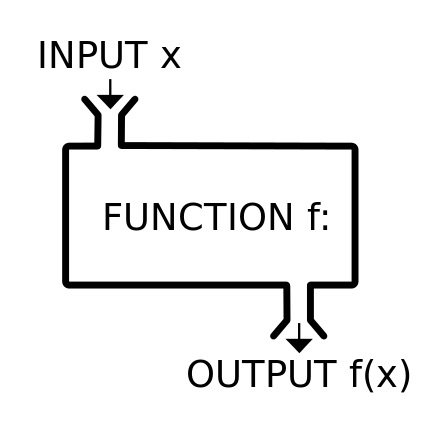
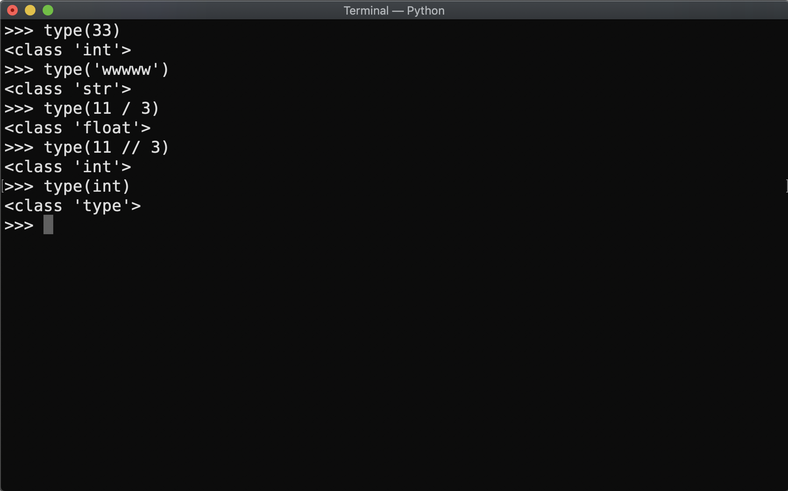

# Functions & Classes & Methods

###### Wu-Jun Pei @ CSCamp 2019

--

## 前情提要

---

#### Flow Control (i)
- if
- elif
- else

---

#### Flow Control (ii)
- for
- while

---

#### 預告
- 和 challenge 有強大關係
- 電爆隔壁隊

--

## Function

---

#### Function


---

#### Function - math

$$
f(x) = \sin x
$$

---

#### Function - python

```python
l = list(range(1, 99, 7))
len(l)
type(len)
type(range)
```

---

#### Function
- input -> output
- 簡化程式碼
- 自己寫 👍
- 別人幫你寫好 👍👍
- challenge 助教幫你寫好 👍👍👍
- 會使用 > 會寫

---

#### Function - Useful Functions
- `len`
- `max`/`min`
- `range`
- `sort`
- ......

---

#### Function - Useful Functions
- Too many to list
- [Python Standard Library](https://docs.python.org/3/library/)
- 大部分想做的東西都可以在 [PyPI](https://pypi.org) 中找到對應的函式庫
- 任務取向

---

#### Function - google it


<p class="Ref">Reference: [I am Programmer, I have no life](https://www.facebook.com/ProgrammersCreateLife/photos/a.241809332534619/2308733899175475/?type=3&theater)</font>


---

#### Function - Design by Yourself
```python
def functionName(parameters):
    # do something
    return returnValue
```
- `functionName`：function 的名字
- `parameters`：傳進 function 的參數，可以有多個
- `return`：回傳 `returnValue`

---

#### Function - 參數
```python
def adjustScore(scores, a, b):
    return [a * x + b for x in scores]

newScores = adjustScore([47, 72, 100, 60, 99], 0.5, 50)
print(newScores)
```
- `scores`：分數 list
- `a, b`：將分數乘 a 加 b

---

#### Function - 參數預設值
```python
def adjustScore(scores, a = 1, b = 0):
    return [a * x + b for x in scores]

# Nothing
print(adjustScore([47, 72, 100, 60, 99]))

# Double
print(adjustScore([47, 72, 100, 60, 99], 2))
print(adjustScore([47, 72, 100, 60, 99], a = 2))

# Plus 10
print(adjustScore([47, 72, 100, 60, 99], b = 10))
```
- `scores`：分數 list
- `a, b`：將分數乘 a 加 b，預設 a 是 1、b 是 0

---

#### Function - 回傳值
```python
def adjustScore(scores, a = 1, b = 0):
    return [a * x + b for x in scores]
```
- 只能有恰好一個回傳值
- 通常可以用 type 查看回傳值型態
    ```python
type(adjustScore([47, 72, 100, 60, 99], b = 10))
```

---

#### Function - 沒有回傳值
```python
def sayHello(s):
    print('Hello,', s)
```
- 沒有回傳值（？
- 查看 type
    ```python
type(sayHello('Python'))
```
- 其實是 <font class="Mark">NoneType</font> 的

---

#### Function - 多個回傳值（？

```python
def quadratic(a, b, c):
    return (-b - (b ** 2 - 4 * a * c) ** 0.5) / (2 * a), \
        (-b + (b ** 2 - 4 * a * c) ** 0.5) / (2 * a)

x1, x2 = quadratic(1, 2, -3)
print(x1, x2)
```
- 有些時候我們可能會想要有多個回傳值
- 此時我們可以以 <font class="Mark">tuple</font> 將多個回傳值包起來<br>
這樣看起來很像有兩個回傳值吧xD
- 查看 type
    ```python
type(quadratic(1, 2, -3))
```

---

#### Practice - Calling a Function
使用下頁的 function，在不更改 function 的前提下，完成以下任務：

輸入班上 $N$ 個人的成績，印出第 $i$ 個學生的 rank。

---

#### Practice - Calling a Function

```python
def calcRank(scores):
    rank = {}
    for i, s in enumerate(sorted(scores, reverse = True)):
        if s not in rank:
            rank[s] = i + 1
    return [rank[s] for s in scores]
```
先查看 <font class="Mark">參數</font>、<font class="Mark">回傳值</font>
- 參數：一個 list of integers，代表原始成績
- 回傳值：一個 list of integers，代表排名
- 中間實作：不太重要，會 Work 就好

---

#### Practice - Calling a Function
Sample Code (`rank.py`)
```python
# 續上頁

N = int(input('Number of students: '))

# scores: a list of (int) scores
scores = [int(x) for x in input('Scores: ').split(' ')]
i = int(input('i: '))

# TODO
```

---

#### Solution - Calling a Function
To be continued...

--

## Class

---

#### 好像看過


---

#### Class
```python
class className:
    def __init__(self):
        self.attribute = # some value
        # do something
```
-  `className`：class 的名字
-  `__init__`：建構子，其實也是一個 method，在 class 被宣告時會呼叫他。
-  `self`：通常作為 method 的第一個參數，並作為和 class 本身的 attributes 以及 methods 溝通的橋樑。雖然可以命名為其他名稱，但 self 已成一個公認的命名傳統
-  `self.attribute`：class 的 attribute

---

#### 寶寶


---

#### Example

```python
class Pet:
    def __init__(self, species, name):
        self.species = species
        self.name = name
        self.pronounce = 'meow'
        self.weight = 0

cat = Pet('Cat', '寶寶')
print(cat)          # Output: <__main__.Pet object at [somewhere]>
print(type(cat))    # Output: <class '__main__.Pet'>
print(cat.name)     # Output: 寶寶
```

---

#### Method
```python
class className:
    # __init__
    
    def methodName(self):
        # do something
    
    def anotherMethod(self, parameters):
        # do something
```
- `methodName`：method 的名稱。
- method 可以想成是一個 function，只是第一個變數一定要是 `self`，若有其他變數則加在 self 的後面，如 `anotherMethod`。

---

#### Method

```python
class Pet:
    # __init__
    
    def speak(self):
        print(self.pronounce)
    
    def eat(self, calories):
        self.weight += calories / 1000
        print('Weight becomes', self.weight)

cat = Pet('Cat', '寶寶')
cat.speak()                 # Output: meow
cat.eat(2473)               # Output: Weight becomes 2.473
```

---

#### Method & Function
```python
class Champion:
	# __init__

    def speak(self, s = 'Captain Teemo on duty'):
		def SiriSays(s):
			print('Siri Says:', s)
    	SiriSays(s)
```
- `speak` 仍然一個 method
- `SiriSays` 是個 `speak` 的 function

---

#### Practice
就留給 challenge 吧～

--

## Challenge

---

#### *Coding* and *Algorithm*


<p class="Ref">Reference: [I am Programmer, I have no life](https://www.facebook.com/ProgrammersCreateLife/photos/a.241809332534619/2310548222327376/?type=3&theater)</p>

---

#### MAY THE FORCE BE WITH YOU
