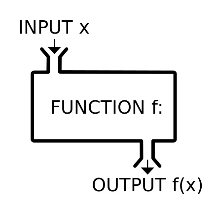
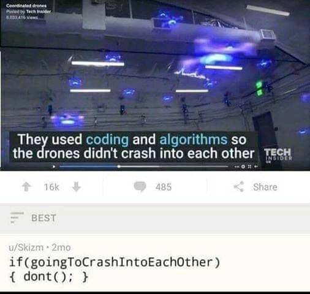

# Functions & <br> Classes & Methods

###### Wu-Jun Pei @ CSCamp 2019

--

## 前情提要

---

#### Flow Control (i)
- if
- elif
- else

---

#### Flow Control (ii)
- for
- while

---

#### 預告
- 和 challenge 有強大關係
- 電爆隔壁隊

--

## Function

---

#### Function


---

#### Function - math

$$
f(x) = \sin x
$$

---

#### Function - python

```python
l = list(range(1, 99, 7))
len(l)
type(len)
type(range)
```

---

#### Function
- input -> output
- 簡化程式碼
- 自己寫 👍
- 別人幫你寫好 👍👍
- challenge 助教幫你寫好 👍👍👍
- 會使用 > 會寫

---

#### Function - Useful Functions
- `len`
- `max`/`min`
- `range`
- `sort`

---

#### Function - Useful Functions
- Too many to list
- 大部分想做的東西都可以在 [PyPI](https://pypi.org) 中找到對應的函式庫
- 任務取向

---

#### Function - google it


Reference: [I am Programmer, I have no life](https://www.facebook.com/ProgrammersCreateLife/photos/a.241809332534619/2308733899175475/?type=3&theater)

---

#### Function - Design by Yourself
```python
def average(x):
	return sum(x) / len(x)
	print('haha') # not going to be executed
```
- `def`：提示接下來 `average` 是一個 function
- `average`：function 的名字
- `x`：傳進 function 的參數，可以很多
- `return`：函式有回傳值（function 的 output），這行之後的程式碼都不會被執行

---

#### Function - Example
```python
def calcRank(scores):
    rank = {}
    for i, s in enumerate(sorted(scores, reverse = True)):
        if s not in rank:
            rank[s] = i + 1
    return [rank[s] for s in scores]
```
- 中間的東西都是黑魔法，不要問你會怕（Ｘ
- 只要在意
	- 函式的 <font class="Mark">參數</font>：一個學生 score 的 list
	- 函式的 <font class="Mark">回傳值</font>：一個學生 rank 的 list
- Example：`[23, 35, 10, 51, 40, 68, 49, 37, 95,  8, 24, 84]`

---

#### Practice - Calling a Function
使用上頁 function 的 example，在不更改 function 的前提下，完成以下任務。<br>
輸入班上 $N$ 個人的成績，印出第 $i$ 個學生的 rank。
<br><br>
Hint
- 先拿到一個有全班排名的 `list`
- 建議創在一個檔案內，學習執行一個檔案 [#TODO HOWTO]

---

#### Practice - Calling a Function
Sample Code (`rank.py`)
```python
def calcRank(scores):
    rank = {}
    for i, s in enumerate(sorted(scores, reverse = True)):
        if s not in rank:
            rank[s] = i + 1
    return [rank[s] for s in scores]

N = int(input('Number of students: '))
scores = [int(x) for x in input('Scores: ').split(' ')]
i = int(input('i: '))

# TODO
```

---

#### Solution - Calling a Function
To be continued...

--

## Class

---

#### 過氣遊戲


---

#### Class

```python
class Champion:
    def __init__(self):
        self.name = 'Teemo'
        self.atk = 54.0
        self.hp = 528.0

        x = 3
        y = 4
        z = 5
        self.lucky_num = x * y * z
```
- `__init__` 是建構子，在一個 Champion 被宣告時就會執行 `__init__`
- `self` 是精髓，代表真正屬於這個 class 的一個 attribute
- 其他的東西（如 `x`、`y`、`z`）都是中間產物，跑完 `__init__` 後就不見了

---

#### Method
```python
class Champion:
	# __init__ folded

    def speak(self):
    	print('Captain Teemo on duty')
    	print(self.lucky_num) # remember `self`
```
- `speak` 是一個 Champion 的 method

---

#### Method
```python
class Champion:
	# __init__ folded

    def speak(self):
		def SiriSays(s):
			print('Siri Says:', s)
    	SiriSays('Captain Teemo on duty')
```
- `speak` 仍然一個 method
- `SiriSays` 是個被 `speak` 呼叫的 function

--

## Challenge

---

#### *Coding* and *Algorithm*



Reference: [I am Programmer, I have no life](https://www.facebook.com/ProgrammersCreateLife/photos/a.241809332534619/2310548222327376/?type=3&theater)

---

#### MAY THE FORCE BE WITH YOU
