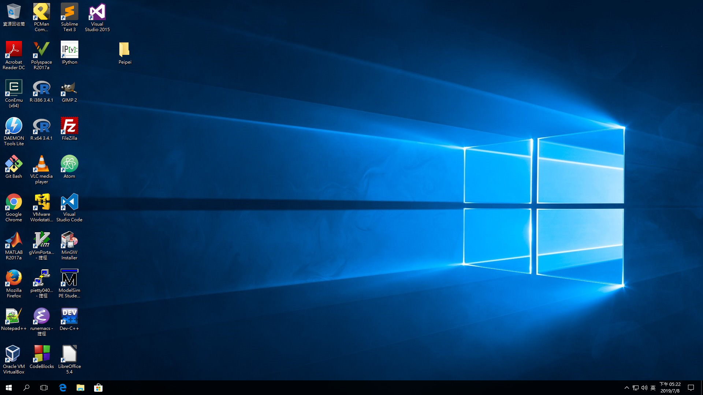
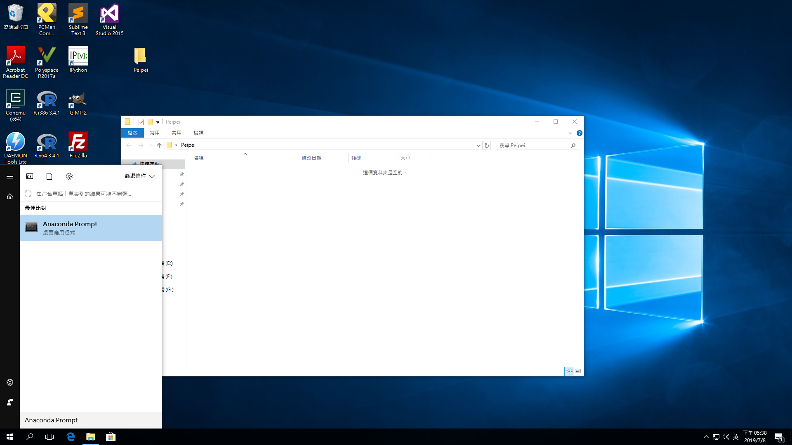
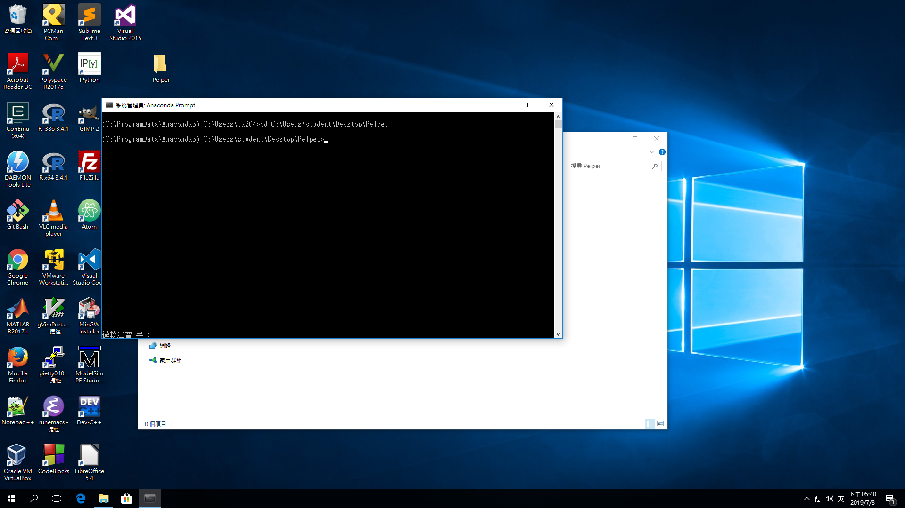
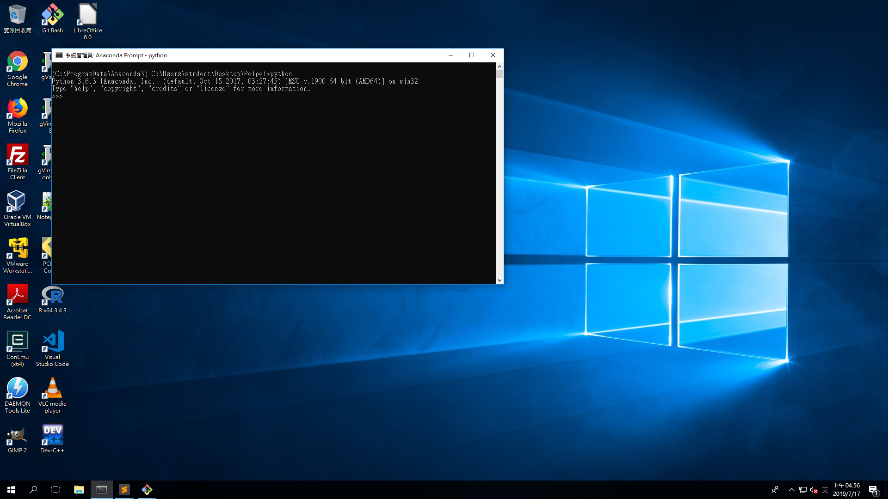
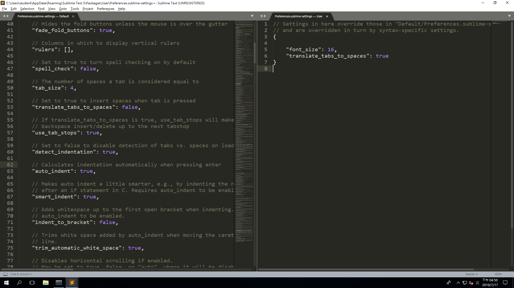
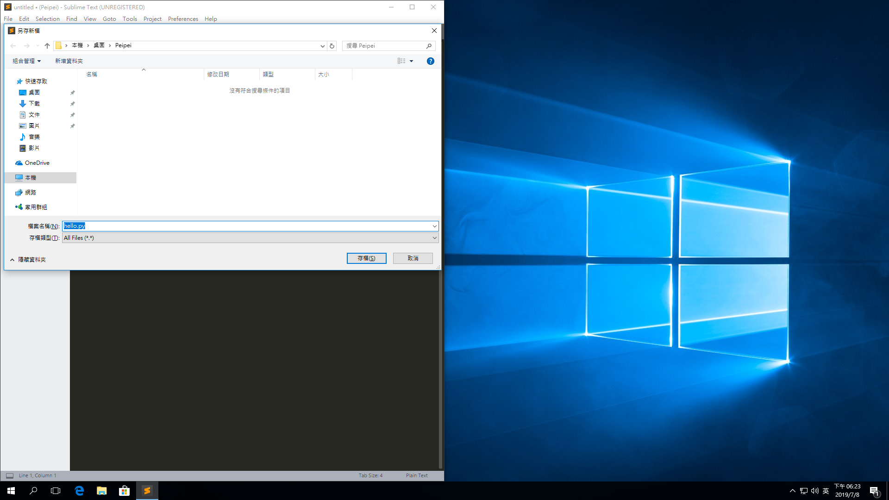

# Guide

<h6 style="text-align: right; font-style: italic;">Wu-Jun Pei @ NTU CSIE Camp 2019</h6>
## Windows Tutorial

#### 使用說明

1. 在桌面創一個資料夾（名稱隨意，此例為 `Peipei`）
    
    
2. 點進去資料夾，在位址列複製位址
    
    
3. 開啟 Anaconda Prompt
    
    並輸入 `cd` 後貼上位址
    
    
4. 執行 python

    -   直接執行直譯器

        ```
        python
        ```

        

    -   執行一個 `.py` 檔
    
        ```cmd
        python xxx.py
        ```

#### 常用指令

-   `dir`：列出資料夾所有檔案
-   `cd Directory`：切換資料夾到 `Directory`

## Sublime Tutorial

-   [Sublime Text 3](https://www.sublimetext.com/3)
-   一個比記事本強一點點的編輯器

#### 使用說明

1.  用鼠標將你創的資料夾滑進去 Sublime Text 3 的 icon 中。
    
    
2.  設定

    1.  眼睛要用很久，字體大小設定
    2.  縮排設定

    在上方點選 "Preferences > Setting" 會開啟一個視窗，在右邊的視窗貼上以下內容：

    ```
    {
    	"font_size": 16,
    	"translate_tabs_to_spaces": true
    }
    ```

    之後存檔後便可以設定完成
    

3.  在左側 side bar 的資料夾上按右鍵，點選 "New File"
  *註：若無左側 side bar 請在上方的 view>side bar 點選 "Show Side Bar"*
  
  之後按下 `ctrl + s` 存檔，檔名的最後請加上 `.py`
  

## Hello World

```python
print('Hello World!!!')
```

#### 直譯器版本


#### 執行一個 python 檔

