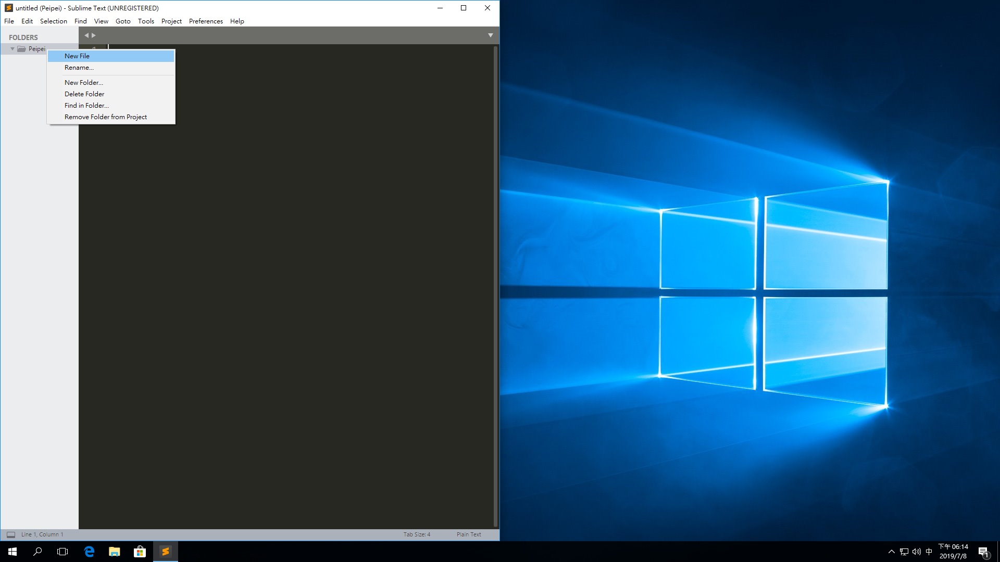

# 2019 CS Camp

## Windows Tutorial

### 使用說明

1. 在桌面創一個資料夾（名稱隨意，此例為 `Peipei`）
    
    
2. 點進去資料夾，在位址列複製位址
    
    
3. 開啟 Anaconda Prompt
    
    並輸入 `cd` 後貼上位址
    
    
4. 執行 python

    -   直接執行直譯器

        ```
        python
        ```

    -   執行一個 `.py` 檔

        ```cmd
        python xxx.py
        ```

## Sublime Tutorial

-   [Sublime Text 3](https://www.sublimetext.com/3)
-   一個比記事本強一點點的編輯器

### 使用說明

1.  用鼠標將你創的資料夾滑進去 Sublime Text 3 的 icon 中。
    
2.  **眼睛要用很久，按下 `ctrl + =` 放大字體**
3.  在左側 side bar 的資料夾上按右鍵，點選 "New File"
	*註：若無左側 side bar 請在上方的 view>side bar 點選 "Show Side Bar"*
	
	之後按下 `ctrl + s` 存檔，檔名的最後請加上 `.py`
	