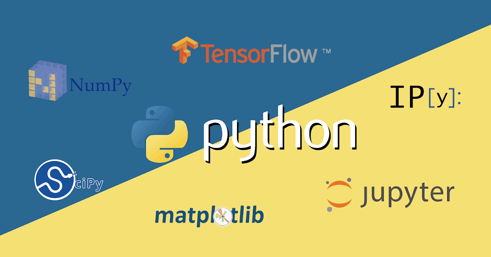

# Introduction to Python

###### Wu-Jun Pei @ CSCamp 2019

--

## Who am I

---

#### About Me
- [資訊之芽](https://www.facebook.com/ntucsiesprout/) C 語法班講師
- 在<font class="Mark">電機系</font>機器學習 pre-test 拿到<font class="Mark">滿分</font>

NOTE:
電爆電機系

--

## What is Python

---



---

#### About Python
- [wikipedia - python](https://zh.wikipedia.org/wiki/Python)
- 直譯式語言
- 使用縮排作為劃分程式碼的依據
- 簡潔、好看懂、好上手

---

#### Zen of Python

> The Zen of Python, by Tim Peters<br>

> Beautiful is better than ugly.

> Explicit is better than implicit.

> Simple is better than complex.

> Complex is better than complicated.

> Flat is better than nested.

> Sparse is better than dense.

> Readability counts.

> ...

開啟 python 後輸入 `import this` 查看！

--

## Objective & Scheduling

---

#### Objective
在上完資訊營的 python 之後，我們希望你能
1. 了解 python 背景知識
2. 把 python 作為一個更強大的計算機
3. 看懂常見的 python 語法、更進一步設計自己的程式碼
4. (<font class="Mark">Necessary</font>) 解出接下來幾天的 challenge，電爆助教群
5. (Optional) 進入我大 CS，CS 發大財


---

### Scheduling

---

|            | Topic                   |
| ---------- | ----------------------- |
| Lecture 1  | Introduction            |
| Lecture 2  | Input/Output & Variables |
| Lecture 3  | Flow Control (i)        |
| Lecture 4  | Flow Control (ii)       |
| Lecture 5  | Functions, Classes & Methods     |

--

## Get Familiar w/ our Environment

---

#### 作業系統 - Windows
- [完整圖文教學](../Guide/#windows-tutorial)

---

#### 編輯器 - Sublime Text 3
- [完整圖文教學](../Guide/#sublime-tutorial)

--

## The First Python Program

---

#### Hello World
- [Hello World](https://zh.wikipedia.org/wiki/Hello_World)
- 沒有 input
- 只有 output 一行 "Hello World!"
- 學會執行一個 python 程式

---

#### Hello World

```python
print('Hello World!!!')
# Line Comment
'''
Block Comment
'''
```
- [完整圖文教學]()
