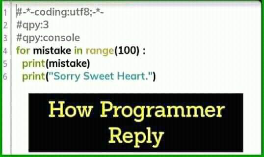

# Flow Control (ii) Loops

###### Wu-Jun Pei @ CSCamp 2019

--

## 前情提要

---

#### Flow Control (i)

- if / elif /else

```python
score = int(input('Please input your math score: '))

if score >= 90:
    print('Great job')
elif score >= 60:
    print('Not bad, keep going on')
else:
    print('See you next year')
```

---

#### Flow Control (i)

```python
if cockroach in room:
    killCockroach()
```
- 只會執行一次
- 打還不一定打得到
- 說不定不只一隻
- 覺得難過

--

## While

---

#### While - 日常生活
<font class="Mark">當</font> Pizza 上有鳳梨，我就會把他挑掉。
- 夏威夷 Pizza 是邪教

---

#### While - Python

```python
while condition:
    # do something
```
- 冒號：提示接下來要縮排
- 縮排：四格空格，接下來有一樣縮排的程式碼都是同一個區塊
- condition：一樣放判斷句

---

#### Example
```python
remainPineapples = 13

while remainPineapples > 0:
    print('Pick some pineapples')
    remainPineapples -= 1

print('Finally...')
```

---

#### Practice - Adventure
冒險者、肥宅、傳說劍士在圍毆 Boss，請問幾回合後 Boss 會死掉？<br>
又，冒險者、肥宅、傳說劍士很有禮貌，他們會依序（冒險者 -> 肥宅 -> 傳說劍士 -> 冒險者 ...）打一下 Boss

- 輸入：Boss 血量，冒險者、肥宅、傳說劍士的攻擊力
- 輸出：需要幾回合 Boss 才會死

---

#### Practice - Adventure
Sample Code（`adventure.py`）
```python
boss_HP = int(input('Boss HP: '))

adverturer_ATK = int(input('Adventurer\'s ATK: '))
fatguy_ATK = int(input('Fat guy\'s ATK: '))
kenshi_ATK = int(input('Kenshi no ATK: '))

rounds = 0

# while loop

print(rounds)
```

---

#### Solution1 - Adventure
```python
boss_HP = int(input('Boss HP: '))

adverturer_ATK = int(input('Adventurer\'s ATK: '))
fatguy_ATK = int(input('Fat guy\'s ATK: '))
kenshi_ATK = int(input('Kenshi no ATK: '))

rounds = 0

while boss_HP > 0:
    boss_HP -= adverturer_ATK
    rounds += 1

    if boss_HP > 0:
        boss_HP -= fatguy_ATK
        rounds += 1
    
    if boss_HP > 0:
        boss_HP -= kenshi_ATK
        rounds += 1

    print('Round {}, boss remain {} HP'.format(rounds, boss_HP))

print(rounds)
```
每個 while 跑三個攻擊者各一次

---

#### Solution2 - Adventure
```python
boss_HP = int(input('Boss HP: '))

adverturer_ATK = int(input('Adventurer\'s ATK: '))
fatguy_ATK = int(input('Fat guy\'s ATK: '))
kenshi_ATK = int(input('Kenshi no ATK: '))

rounds = 0

while boss_HP > 0:
    if rounds % 3 == 0:
        boss_HP -= adverturer_ATK
    elif rounds % 3 == 1:
        boss_HP -= fatguy_ATK
    else:
        boss_HP -= kenshi_ATK

    rounds += 1

    print('Round {}, boss remain {} HP'.format(rounds, boss_HP))

print(rounds)
```
每個 while 只會跑一個攻擊者

--

## For

---

#### Scenario


<p class="Ref">Reference: [I'm Programmer, I Have No Life](https://www.facebook.com/ProgrammersCreateLife/posts/2306646209384244)</p>

---


---



---

#### For
```python
for variable in iterableObject:
    # do something
```
- variable：變數
- iterableObject：可迭代物件
- 冒號：提示接下來要縮排

---

#### Iterable

- [Cambridge Dictionary - iterate](https://dictionary.cambridge.org/zht/詞典/英語-漢語-繁體/iterate)<br>to repeat a process, especially as part of a computer program，重複執行一段程式碼
- iterable object：可以從該 object 依次拿出東西 iterate

---

#### Example
```python
for i in range(10):
    print('Sorry, Sweet Heart')

print(list(range(10)))
```
- `range(10)`：$0, 1, ..., 8, 9$

將 `i` 從 0 到 9 迭代過去

---

#### Iterable - Range
一些數字，常用為計數器
- `range(n)`：從 $0, 1, ..., n - 1$
- `range(m, n)`：從 $m, m + 1, ..., n - 1$
- `range(m, n, k)`：從 $m, m + k, m + 2k, ...$ 直到超過範圍<br>（$k$ 可以是負數，$n - m$ 不一定要是 $k$ 的倍數）

```python
print(list(range(6)))
print(list(range(-3, 3)))
print(list(range(1, 13, 2)))
print(list(range(19, 2, -3)))
```

---

#### Iterable - str/list/tuple
- 從 str 拿出每個字元
- 從 list/tuple 拿出每個 element

```python
for c in 'Python':
    print(c, end = ' - ')

for p in [2, 3, 5, 7, 11, 13, 17, 19]:
    print(p, 'is a prime')
```

---

#### Iterable - dict
- 從 dict 拿出每個 key

```python
d = {'I' : 'My', 'You' : 'Your', 'We' : 'Our'}
for key in d:
    print(key, '->', d[key])

for key, value in d.items():
    print(key, '->', value)
```

---

#### Practice - Sum of Power of 5 (i)
$$ \sum_{i = 1}^N i^5 $$

- 輸入：$N$
- 輸出：五次方和
- <font class="Mark">懸賞</font>：背得出公式解可以獲得神秘小禮物

---

#### Practice - Sum of Power of 5 (i)
Sample Code
```python
N = int(input('Input N'))

total = 0

# For Loop

print(total)
```

---

#### Practice - Sum of Power of 5 (i)
- Input 1
    ```
10
```
- Output 1
    ```
220825
```
- Input 2
    ```
999
```
- Output 2
    ```
166167083333250000
```

---

#### Practice - Sum of Power of 5 (ii)

- 輸入：$N$ 個數字
- 輸出：五次方和

---

#### Practice - Sum of Power of 5 (ii)
Sample Code
```python
# White Magic
numbers = list(int(x) for x in input('Input some numbers: ').split(' '))

total = 0

# For Loop

print(total)
```

---

#### Practice - Sum of Power of 5 (i)
- Input 1
    ```python
1 2 3 4 5
```
- Output 1
    ```
4425
```
- Input 2
    ```python
394 61 186 434 534 433 946 746 843 73
```
- Output 2
    ```
1498164862476930
```

---

#### Solution - Sum of Power of 5 (i) & (ii)
To be continued...

--

## continue & break

---

#### continue
- 直接進到下個 iteration

```python
for i in range(1, 11):
    if i % 3 == 0:
        continue
    print((i // 3) / (i % 3))
```

---

#### break
- 直接跳出這個迴圈

```python
ans = 7.315
for i in range(1024):
    if i < ans and ans < i + 1:
        print('ans is between', i, 'and', i + 1)
        break
    print('Round', i, 'done')
```
